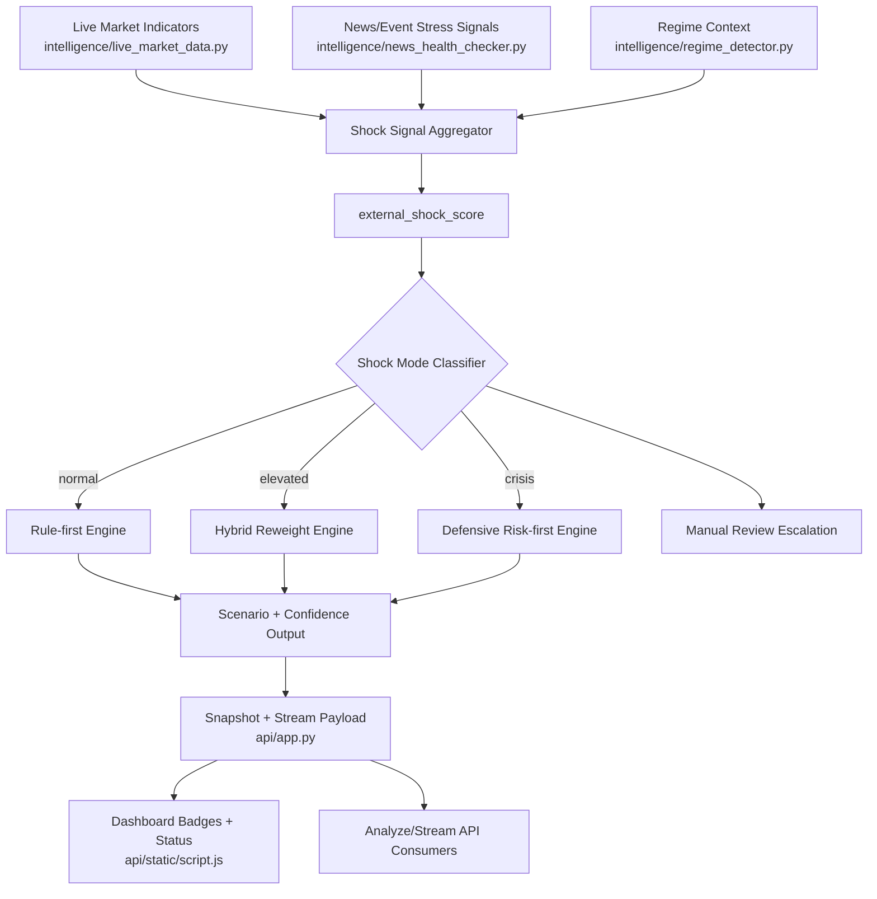

# Finalized Standout System Plan

## Objective
Build a differentiated macro-intelligence platform that stands out through trust, foresight, and measurable decision performance — not just dashboard visuals.

## Product Differentiators to Build
1. Evidence Integrity Layer
2. Regime Shift Early Warning Engine
3. Decision-to-Outcome Learning Loop
4. Counterfactual Scenario Simulator
5. Personalized Playbook Agent
6. External Shock Override & Adaptive Confidence Mode

---

## Guiding Principles
- Keep all existing endpoints backward-compatible.
- Reuse existing dashboard surfaces (no extra pages/modals).
- Ship in strict feature-flagged phases.
- Every feature must produce measurable quality signals.

---

## Target End-State Capabilities

### 1) Evidence Integrity Layer (Trust Moat)
- Every major claim is tied to retrieved evidence.
- Unsupported claims are flagged before final output.
- Response payload includes integrity metrics and warning level.

### 2) Regime Shift Early Warning (Foresight Moat)
- Detect transition risk before full regime change.
- Provide transition probability, likely next regime, and trigger/invalidation conditions.
- Stream warning level live to UI badges.

### 3) Decision-to-Outcome Loop (Learning Moat)
- Convert recommendations into trackable decision records.
- Evaluate outcomes against horizon and trigger/invalidation logic.
- Expose hit-rate and calibration metrics for continuous improvement.

### 4) Counterfactual Simulator (Decision Depth)
- Support what-if shocks against current indicator snapshot.
- Return baseline vs shocked deltas in regime/signal/action.
- Reuse existing compare UI flow.

### 5) Personalized Playbook Agent (User-Specific Alpha)
- Respect user profile constraints (risk style, allowed instruments, limits).
- Explain exactly how personalization changed recommendations.
- Support advisory and strict enforcement modes.

---

## Execution Phases

## Phase 1 — Contract & Schema Foundation
### Goal
Create one consistent payload contract for all advanced features.

### Changes
- Extend response schema for:
  - `evidence_integrity`
  - `regime_warning`
  - `decision_stub`
  - `counterfactual_result`
  - `personalization`
- Keep all existing fields untouched.

### Touchpoints
- `/home/kali/Downloads/Qual/intelligence/response_schema.py`
- `/home/kali/Downloads/Qual/intelligence/response_middleware.py`
- `/home/kali/Downloads/Qual/intelligence/response_validator.py`
- `/home/kali/Downloads/Qual/docs/response_contract_v2.md`
- `/home/kali/Downloads/Qual/docs/WRITING_STYLE_GUIDE.md`

### Exit Criteria
- New optional blocks validate successfully.
- Legacy clients still parse responses without changes.

---

## Phase 2 — Evidence Integrity Layer
### Goal
Make answer trust explicit and machine-evaluable.

### Changes
- Add claim-to-evidence support scoring.
- Add source freshness and diversity metrics.
- Add integrity status: `pass | warning | review_required`.
- Enforce warnings in final payload and UI quality summary.

### Touchpoints
- `/home/kali/Downloads/Qual/api/app.py` (`_make_structured_payload`, stream final payload assembly)
- `/home/kali/Downloads/Qual/intelligence/response_enhancer.py`
- `/home/kali/Downloads/Qual/intelligence/data_quality.py`
- `/home/kali/Downloads/Qual/api/static/script.js` (`renderEvidenceCoverage`, `renderPlainSummary`)
- `/home/kali/Downloads/Qual/api/static/index.html` (existing evidence/quality sections)

### Exit Criteria
- Unsupported claims are counted and surfaced.
- Integrity metadata appears on analyze + stream final responses.

---

## Phase 3 — Regime Shift Early Warning
### Goal
Detect and communicate regime transition risk before it fully materializes.

### Changes
- Add transition-probability computation around existing regime logic.
- Add warning tiers: `watch`, `elevated`, `imminent`.
- Add trigger/invalidation conditions for warning resolution.
- Stream warnings via market and intelligence paths.

### Touchpoints
- `/home/kali/Downloads/Qual/intelligence/regime_detector.py`
- `/home/kali/Downloads/Qual/intelligence/cross_asset_analyzer.py`
- `/home/kali/Downloads/Qual/intelligence/live_market_data.py`
- `/home/kali/Downloads/Qual/api/app.py` (`_build_snapshot`, `market_data_live_stream`, `intelligence_stream`)
- `/home/kali/Downloads/Qual/api/static/script.js` (`updateSnapshot`, badges)

### Exit Criteria
- Snapshot contains `regime_warning` block.
- UI reflects warning tier without noisy flicker.

---

## Phase 4 — Decision-to-Outcome Loop
### Goal
Create closed-loop learning from generated recommendations to realized outcomes.

### Changes
- Extract decision stubs from responses.
- Persist decision records and evaluation outcomes.
- Add calibration metrics (confidence vs realized accuracy).
- Join feedback data with outcomes.

### Touchpoints
- `/home/kali/Downloads/Qual/api/app.py` (`/feedback`, `/metrics`, analyze/stream final payload)
- `/home/kali/Downloads/Qual/intelligence/query_logger.py`
- `/home/kali/Downloads/Qual/data/feedback_log.jsonl`
- `/home/kali/Downloads/Qual/data/query_log.jsonl`
- New: `/home/kali/Downloads/Qual/data/decision_outcome_log.jsonl`
- `/home/kali/Downloads/Qual/api/static/script.js` (history/status summaries)

### Exit Criteria
- Open/closed decision metrics are available via API.
- Dashboard history can show outcome state.

---

## Phase 5 — Counterfactual Simulator
### Goal
Allow deterministic what-if analysis for decision support.

### Changes
- Accept structured shocks in request.
- Compute and return baseline vs shocked outputs.
- Add delta summary (regime/signal/action/quality deltas).
- Reuse compare section in current UI.

### Touchpoints
- `/home/kali/Downloads/Qual/api/app.py` (`IntelligenceRequest`, analysis path)
- `/home/kali/Downloads/Qual/intelligence/indicator_parser.py`
- `/home/kali/Downloads/Qual/intelligence/agentic_rag/orchestrator.py`
- `/home/kali/Downloads/Qual/api/static/script.js` (`basePayload`, `runCompare`)
- `/home/kali/Downloads/Qual/api/static/index.html` (existing compare region)

### Exit Criteria
- Same input shocks produce same delta output.
- Counterfactual result block is returned when requested.

---

## Phase 6 — Personalized Playbook Agent
### Goal
Deliver user-specific recommendations with clear constraints and rationale.

### Changes
- Add user profile model (risk, mandate, constraints, banned assets).
- Apply constraints during synthesis.
- Add personalization explainability block.
- Support profile enforcement modes (`advisory`, `strict`).

### Touchpoints
- `/home/kali/Downloads/Qual/intelligence/agentic_rag/agent_state.py`
- `/home/kali/Downloads/Qual/intelligence/agentic_rag/orchestrator.py`
- `/home/kali/Downloads/Qual/intelligence/prompt_templates.py`
- `/home/kali/Downloads/Qual/intelligence/model_router.py`
- `/home/kali/Downloads/Qual/session_memory.json`
- `/home/kali/Downloads/Qual/api/app.py` (`AgenticRequest`, final payload)

### Exit Criteria
- Recommendations respect constraints in strict mode.
- Payload includes personalization rationale and profile version.

---

## Phase 7 — External Shock Override & Adaptive Confidence Mode (Last Option)
### Goal
Prevent rule-only failures during high-impact external events (geopolitics, emergency policy actions, liquidity dislocations) by switching to an adaptive control mode.

### Changes
- Add an `external_shock_score` derived from event feed + market stress indicators.
- Add `shock_mode` states: `normal`, `elevated`, `crisis`.
- In `elevated/crisis`, reduce deterministic rule weight and reweight scenario probabilities.
- Enable confidence degradation behavior:
  - lower confidence band,
  - wider scenario ranges,
  - emphasize risk-management over directional certainty.
- Add explicit trigger/invalidation logic for entering/exiting shock mode.
- Add optional manual-review flag when shock uncertainty crosses threshold.

### Touchpoints
- `/home/kali/Downloads/Qual/intelligence/regime_detector.py`
- `/home/kali/Downloads/Qual/intelligence/cross_asset_analyzer.py`
- `/home/kali/Downloads/Qual/intelligence/live_market_data.py`
- `/home/kali/Downloads/Qual/intelligence/news_health_checker.py`
- `/home/kali/Downloads/Qual/api/app.py` (`_build_snapshot`, `intelligence_stream`, `market_data_live_stream`)
- `/home/kali/Downloads/Qual/api/static/script.js` (badges/status/confidence presentation)
- `/home/kali/Downloads/Qual/api/static/index.html` (existing badge/status area only)

### Exit Criteria
- System enters shock mode deterministically on configured trigger conditions.
- Confidence and scenario presentation adapt automatically in shock mode.
- Shock-mode transitions are visible in existing UI badges without adding new pages/modals.
- Rule-based outputs remain default when shock mode is `normal`.

---

## Verification Plan

### Automated tests
- Extend:
  - `/home/kali/Downloads/Qual/tests/test_api_ask_v2_contract.py`
  - `/home/kali/Downloads/Qual/tests/test_api_intelligence_mcp_enrichment.py`
  - `/home/kali/Downloads/Qual/tests/test_agentic_rag.py`
  - `/home/kali/Downloads/Qual/tests/test_response_renderer.py`
- Add:
  - `tests/test_evidence_integrity.py`
  - `tests/test_regime_shift_warning.py`
  - `tests/test_decision_outcome_loop.py`
  - `tests/test_counterfactual_simulator.py`
  - `tests/test_personalized_playbook.py`

### Runtime checks
- `python run_quality_gate.py --run-pytest`
- `python run_rag_eval.py`
- `python run_data_quality_audit.py`

### Manual checks
- Validate `analyze` + `stream` payload blocks for each feature flag.
- Validate dashboard rendering in existing sections only.
- Validate fail-safe behavior when optional components are unavailable.

---

## Rollout Controls
- Feature flags:
  - `FEATURE_EVIDENCE_INTEGRITY`
  - `FEATURE_REGIME_EARLY_WARNING`
  - `FEATURE_DECISION_OUTCOME_LOOP`
  - `FEATURE_COUNTERFACTUAL_SIMULATOR`
  - `FEATURE_PERSONALIZED_PLAYBOOK`
  - `FEATURE_EXTERNAL_SHOCK_OVERRIDE`
- Rollout sequence:
  1. Internal-only enablement
  2. Limited user cohort
  3. Full rollout after quality gate + regression checks
- Instant rollback: disable feature flags, keep legacy response path active.

---

## Risks and Mitigations
- False positives in warnings → add hysteresis/debounce and confidence thresholds.
- Payload bloat/latency → keep new blocks optional and compact.
- Over-constrained personalization → default advisory mode with clear overrides.
- Contract drift → validator + middleware enforcement and contract tests.

---

## Final Delivery Checklist
- [ ] Response schema + contract docs updated.
- [ ] Evidence Integrity Layer shipped behind flag.
- [ ] Regime Shift Early Warning shipped behind flag.
- [ ] Decision-to-Outcome Loop shipped behind flag.
- [ ] Counterfactual Simulator shipped behind flag.
- [ ] Personalized Playbook Agent shipped behind flag.
- [ ] External Shock Override & Adaptive Confidence Mode shipped behind flag.
- [ ] Test suite + quality gate pass.
- [ ] Dashboard validated with no new pages/modals.
- [ ] Rollback controls documented and tested.

---

## Architecture Flow (Phase 7)

### Runtime Decision Flow
1. Aggregate live market stress and external-event signals into a unified shock feature set.
2. Compute `external_shock_score` with deterministic thresholds.
3. Classify `shock_mode` as `normal`, `elevated`, or `crisis`.
4. Reweight inference path:
   - `normal`: retain rule-first behavior.
   - `elevated`: blend rules with transition/surprise weighting.
   - `crisis`: prioritize downside-risk controls and confidence degradation.
5. Emit updated scenario probabilities, confidence band, and trigger/invalidation metadata.
6. Surface shock mode in existing dashboard badges and API payloads.
7. Trigger manual-review escalation when configured threshold is breached.

### Control and Safety Hooks
- Feature flag gate: `FEATURE_EXTERNAL_SHOCK_OVERRIDE`.
- Hard fallback: if shock pipeline fails, revert to `normal` mode and existing rule logic.
- Logging requirement: record mode transitions and score inputs for auditability.
